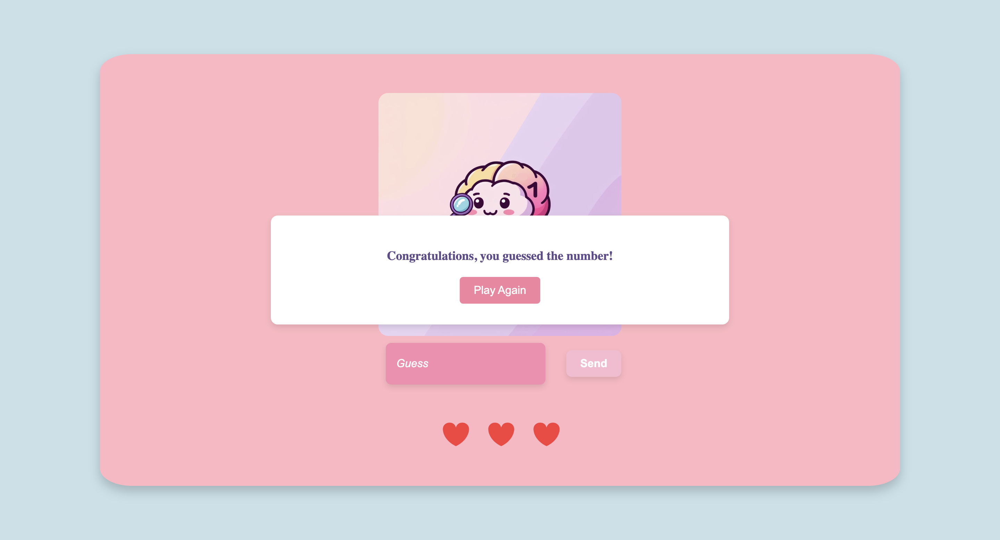
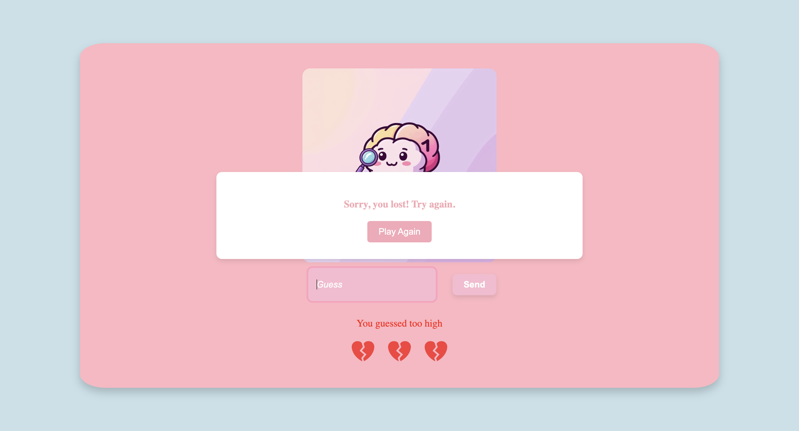

# 🎮 **Number Guessing Game**

## 📖 Description

This project is an interactive game where the user has to guess a randomly generated number between **1 and 100**. With each guess, the player receives a message indicating whether their guess is:

- Too **high**
- Too **low**
- Or **correct**

The player has **3 lives**, represented by hearts ❤️. Each time the guess is incorrect, the player loses a heart. If all hearts are lost, the player loses the game. If the user guesses correctly, a **win message** is displayed.

---

## 🚀 Features

- Random number generation between **1 and 100**.
- Indication if the guess is too **high**, too **low**, or **correct**.
- **Three lives** represented by hearts (each time a player loses a life, the corresponding heart breaks).
- Win and lose messages with options to **restart** the game.
- Ability to **restart** the game regardless of the outcome.

---

## 💻 Technologies Used

- **HTML**
- **CSS**
- **JavaScript**

---

## 🔧 How to Use

### 1. Clone the Repository:

To get started, clone the repository to your local machine:

```bash
git clone <repository-url>
```

### 2. Open the Project:

Open the index.html file in your browser to start the game.

### 3. Playing the Game:

Enter a number between 0 and 100 in the input field.

Click the "Submit" button or press Enter to submit your guess.

If the guess is correct, you will see a congratulations message.

If the guess is too high or too low, you will lose one heart.

Once all hearts are lost, the game will end and you will see a lose message. You can restart the game by clicking the "Restart" button.

If you guess correctly, you will be congratulated and can restart the game as well.

### 4. Restart the Game:

After a win or loss, you can click the "Restart" button to reset the game and start a new round.

### 📸 Screenshots

### 🏆 Win Screen



### 💔 Lose Screen


